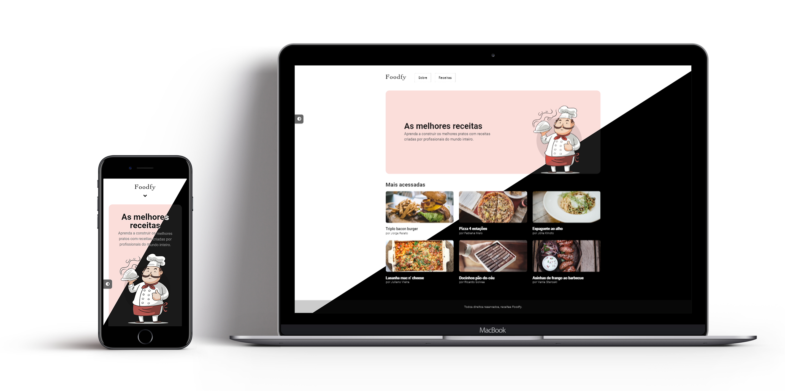

    
    <h2 align="center">
        Foodfy
    </h2>
    

        Foodfy website, a culinary recipe company.
    

 

# About The Project

### Create a **culinary recipe website**.

The project goals learning frontend and backend technologies, like:

- **Frontend**
  - HTML
  - CSS
  - Javascript
- **Backend**
  - NodeJs
  - NPM
  - Create server (_Express_)
    - Use routes
    - Use dynamic data
  - Template Engine (_Nunjucks_)

# Features

### Main features

- Template to pages
- Styling with `CSS grid` and `flexbox`
- Routes created by the recipe data
- Show/hide sections in the description recipe page

### Plus features

- Styling CSS with `BEM CSS` convention
- Fully **responsive** layout
- **Dark mode**

# Getting Started

### Prerequisites

The [NodeJS](https://nodejs.org/) is **required** to be able to run this project. Install in your machine and go to the next steps.

### Installation

**1.** Clone repository

`git clone git@github.com:rpradosilva/foodfy.git`

**2.** Install NPM Packages

`npm i`

**3.** Run project

`npm start`

# License

This project is protected by the MIT license. See the file [LICENSE](/LICENSE) for more details.
 

---

